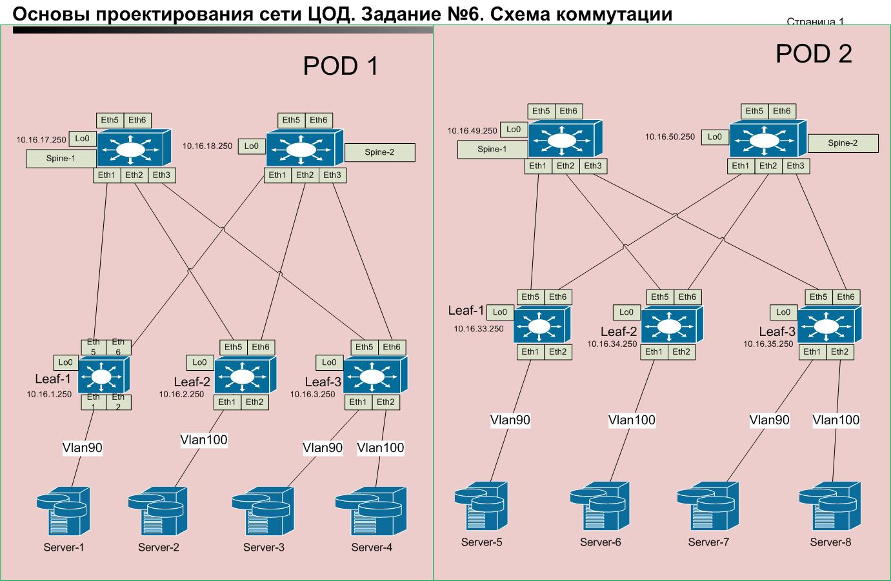
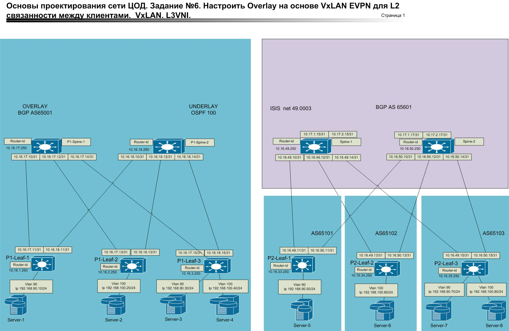

Домашнее задание
VxLAN. L3VNI

Цель:
Настроить маршрутизацию в рамках Overlay между клиентами.
В данной работе хочется реализовать два варианта Asymmetric IRB и Symmetric IRB.     

     
      

### В POD1 реализуется  Asymmetric IRB.    
### UNDERLAY строим на OSPF
Пример для P1-Leaf-1    
router ospf 100  
   router-id 10.16.1.250  
   bfd default  
   passive-interface default  
   no passive-interface Ethernet5  
   no passive-interface Ethernet6  
   network 10.16.1.250/32 area 0.0.0.0  
Интерфейсы Ethernet5 и Ethernet6 на P1-Spine-1 и P1-Spine-2.       

### OVERLAY строим на iBGP 
Пример для P1-Leaf-1     
router bgp 65001
   router-id 10.16.1.250  
   timers bgp 3 9  
   maximum-paths 2 ecmp 2  
   neighbor UNDERLAY peer group  
   neighbor UNDERLAY remote-as 65001   
   neighbor UNDERLAY update-source Loopback0   
   neighbor UNDERLAY send-community extended   
   neighbor 10.16.17.250 peer group UNDERLAY   
   neighbor 10.16.18.250 peer group UNDERLAY  
exit   

### После построения L3 связности между Leaf и Spine настраиваем VXLan

vlan 90    (создаем Vlan)       
   name Servers-1     
exit  

interface Vxlan1  ( создаем Vxlan )    
   vxlan source-interface Loopback0   
   vxlan udp-port 4789   
   vxlan vlan 90 vni 10090 (настраиваем vlan и связываем с vni)     
exit  
router bgp 65001 ( добавляем информацию о vlan в bgp )      
vlan 90   
      rd auto   
      route-target both 90:10090   
      redistribute learned   
   !    
   address-family evpn   
      neighbor UNDERLAY activate  
exit     

Убеждаемся, что все работает.
Взамодействие между хостами  192.168.90.10 и 192.168.90.30 Vlan90, 192.168.100.20 и 192.168.100.40.

### Настройка L3VNI.     
vlan 100    (Добавляе Vlan)
   name Servers-2    
exit   

ip virtual-router mac-address 02:00:00:00:00:00    
interface Vlan90   (Поднимаем маршрутизацию)      
   ip address 192.168.90.1/24   
   ip virtual-router address 192.168.90.254/24    
exit   

interface Vlan100   (Поднимаем маршрутизацию)      
   ip address 192.168.100.1/24    
   ip virtual-router address 192.168.100.254/24      
 exit     
 
[Конфигурации оборудования](./POD1_CFG).    

Убеждаемся что есть взаимодействие между хостами. 

### ping с хоста 192.168.90.10     

84 bytes from 192.168.100.40 icmp_seq=9365 ttl=63 time=25.566 ms   
84 bytes from 192.168.100.40 icmp_seq=9366 ttl=63 time=13.053 ms    
84 bytes from 192.168.100.40 icmp_seq=9367 ttl=63 time=14.329 ms    
84 bytes from 192.168.100.40 icmp_seq=9368 ttl=63 time=21.173 ms     
84 bytes from 192.168.100.40 icmp_seq=9369 ttl=63 time=20.327 ms    
84 bytes from 192.168.100.40 icmp_seq=9370 ttl=63 time=25.775 ms    
84 bytes from 192.168.100.40 icmp_seq=9371 ttl=63 time=22.461 ms    
84 bytes from 192.168.100.40 icmp_seq=9372 ttl=63 time=27.854 ms    
84 bytes from 192.168.100.40 icmp_seq=9373 ttl=63 time=22.549 ms   
84 bytes from 192.168.100.40 icmp_seq=9374 ttl=63 time=25.686 ms     
84 bytes from 192.168.100.40 icmp_seq=9375 ttl=63 time=21.494 ms    

[Тестовые команды с P1-Leaf-1](./test/P1-Leaf-1.txt)   

### В POD1 реализуется  Symmetric IRB.    
### UNDERLAY строим на ISIS настройки из Lab_5
Пример для P2-Leaf-1     
router isis underlay    
   net 49.0003.0100.1603.3250.00    
   is-type level-1   
   log-adjacency-changes    
   !    
   address-family ipv4 unicast    
exit     
interface Ethernet5   
   description to-Pod2-Spine-1-Eth1  
   mtu 9000   
   no switchport   
   ip address 10.16.49.11/31    
   isis enable underlay   
   isis bfd   
   isis circuit-type level-1   
   isis network point-to-point   
exit   
interface Ethernet6   
   description to-Pod2-Spine-2-Eth1   
   mtu 9000   
   no switchport   
   ip address 10.16.50.11/31   
   isis enable underlay   
   isis bfd   
   isis circuit-type level-1   
   isis network point-to-point   
   exit   
Интерфейсы Ethernet5 и Ethernet6 на P1-Spine-1 и P1-Spine-2.       

### OVERLAY строим на eBGP настройки из Lab_5     
Пример для P1-Leaf-1     
router bgp 65101    
   router-id 10.16.33.250    
   no bgp default ipv4-unicast    
   timers bgp 3 9    
   distance bgp 20 200 200   
   maximum-paths 2 ecmp 2    
   neighbor UNDERLAY peer group    
   neighbor UNDERLAY remote-as 65601    
   neighbor UNDERLAY next-hop-unchanged    
   neighbor UNDERLAY out-delay 0    
   neighbor UNDERLAY update-source Loopback0    
   neighbor UNDERLAY ebgp-multihop 2    
   neighbor UNDERLAY send-community extended    
   neighbor 10.16.49.250 peer group UNDERLAY    
   neighbor 10.16.50.250 peer group UNDERLAY   
   !   
   
   address-family ipv4    
      neighbor UNDERLAY activate    
   !    
   vrf VRF-Router   
      rd 65101:21   
      route-target import evpn 21:111111   
      route-target export evpn 21:111111    
      redistribute connected    
   
### После построения L3 связности между Leaf и Spine настраиваем vrf и VXLan    
    
vlan 90   
   name Servers-1    
exit    
vlan 100    
   name Servers-2   
exit   
vrf instance VRF-Router    
   rd 65101:21   
   exit   
ip routing vrf VRF-Router    
interface Vlan90   
   vrf VRF-Router   
   ip address 192.168.90.4/24    
   ip virtual-router address 192.168.90.254    
exit    
interface Vxlan1    
   vxlan source-interface Loopback0   
   vxlan udp-port 4789    
   vxlan vlan 90 vni 10090   
   vxlan vlan 100 vni 100100   
   vxlan vrf VRF-Router vni 111111   
exit   
ip virtual-router mac-address 02:02:00:00:00:00   
exit   
    
router bgp 65101   
   vlan 100   
      rd auto    
      route-target both 100:100100   
      redistribute learned   
   !   
   vlan 90    
      rd auto   
      route-target both 90:10090    
      redistribute learned    
   !
   address-family evpn    
      neighbor UNDERLAY activate  
   exit     
        
  [Конфигурации оборудования](./POD2_CFG).     

### ping с хоста 192.168.90.50     

84 bytes from 192.168.100.60 icmp_seq=2575 ttl=62 time=13.539 ms   
84 bytes from 192.168.100.60 icmp_seq=2576 ttl=62 time=16.335 ms   
84 bytes from 192.168.100.60 icmp_seq=2577 ttl=62 time=14.353 ms    
84 bytes from 192.168.100.60 icmp_seq=2578 ttl=62 time=17.121 ms    
84 bytes from 192.168.100.60 icmp_seq=2579 ttl=62 time=17.928 ms   
84 bytes from 192.168.100.60 icmp_seq=2580 ttl=62 time=19.675 ms    
84 bytes from 192.168.100.60 icmp_seq=2581 ttl=62 time=18.508 ms    
84 bytes from 192.168.100.60 icmp_seq=2582 ttl=62 time=15.829 ms    
84 bytes from 192.168.100.60 icmp_seq=2583 ttl=62 time=15.947 ms    
    
### ping с хоста 192.168.100.80   
    
84 bytes from 192.168.90.50 icmp_seq=2224 ttl=62 time=16.656 ms    
84 bytes from 192.168.90.50 icmp_seq=2225 ttl=62 time=19.637 ms    
84 bytes from 192.168.90.50 icmp_seq=2226 ttl=62 time=19.605 ms   
84 bytes from 192.168.90.50 icmp_seq=2227 ttl=62 time=20.261 ms    
84 bytes from 192.168.90.50 icmp_seq=2228 ttl=62 time=20.051 ms    
84 bytes from 192.168.90.50 icmp_seq=2229 ttl=62 time=25.402 ms    
84 bytes from 192.168.90.50 icmp_seq=2230 ttl=62 time=23.093 ms    
84 bytes from 192.168.90.50 icmp_seq=2231 ttl=62 time=22.557 ms    
84 bytes from 192.168.90.50 icmp_seq=2232 ttl=62 time=17.282 ms    

[Тестовые команды с P2-Leaf-1](./test/P2-Leaf-1.txt)     

Обе реализованные схемы рабочие. Взаимодействие между хостами есть.

   
