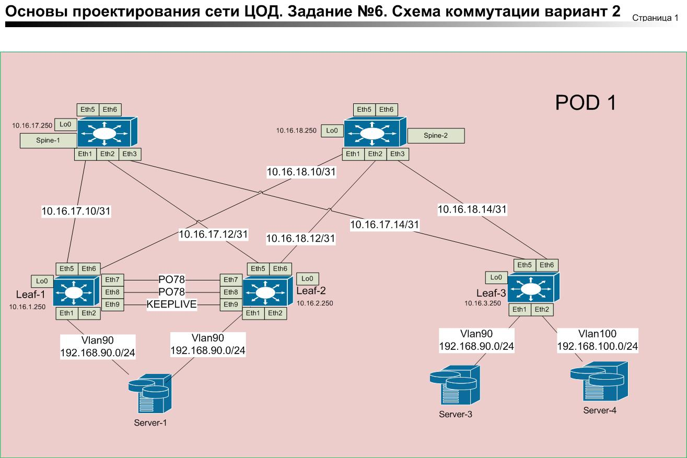
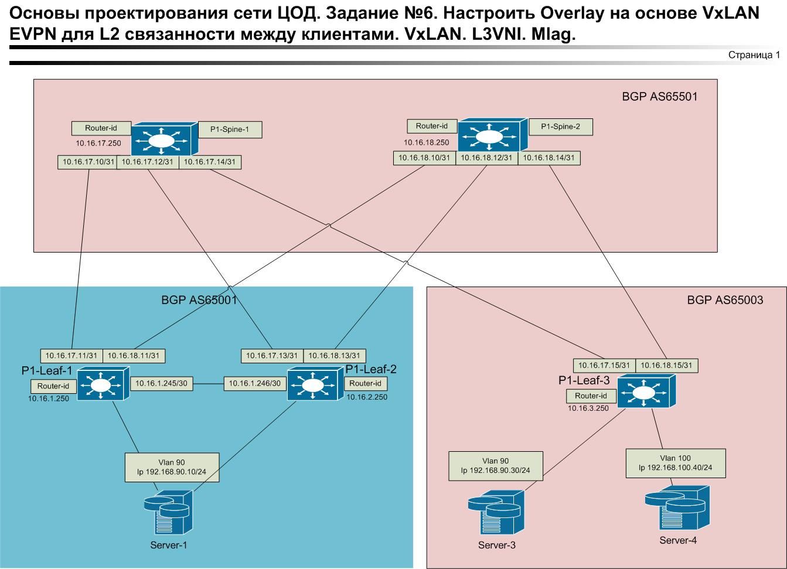

### Лабораторная работа 6. Вариант 2.

Целью данной работы стало изучение технологии VXLAN, EVPN-VXLAN, L3VNI, MLAG.    

        

.      

####  Описание схемы.

### UNDERLAY
Строим на протоколе eBGP.    
Пример Leaf-1.     
router bgp 65001   
   router-id 10.16.1.250   
   no bgp default ipv4-unicast   
   timers bgp 3 9    
   distance bgp 20 200 200    
   maximum-paths 2 ecmp 2     
   neighbor UNDERLAY peer group    
   neighbor UNDERLAY remote-as 65501     
   neighbor UNDERLAY out-delay 0      
   neighbor UNDERLAY-MLAG peer group / к соседу Leaf-2 /    
   neighbor UNDERLAY-MLAG remote-as 65001    
   neighbor UNDERLAY-MLAG next-hop-self     
   neighbor 10.16.1.246 peer group UNDERLAY-MLAG      
   neighbor 10.16.17.10 peer group UNDERLAY    
   neighbor 10.16.18.10 peer group UNDERLAY      
   address-family ipv4     
      neighbor UNDERLAY activate    
      neighbor UNDERLAY-MLAG activate    
      network 10.16.1.250/32   
      network 10.16.1.251/32   
end    
### OVERLAY  
interface Loopback1    
   description VXLAN-VTEP      
   ip address 10.16.1.251/32    
   exit     
    vrf VRF-Router  / vrf для маршрутизации между Vlan в одном VRF  /     
      rd 65001:11     
      route-target import evpn 11:111111    
      route-target export evpn 11:111111    
      redistribute connected     
      exit    
  interface Vlan90   / Vlan клиента /     
   vrf VRF-Router    
   ip address 192.168.90.1/24    
   ip virtual-router address 192.168.90.254/24   
   exit
   ip virtual-router mac-address 02:00:00:00:00:00 / виртуальный mac /             
interface Vxlan1    
   vxlan source-interface Loopback1   /строим от Lo1 /
   vxlan udp-port 4789   
   vxlan vlan 90 vni 10090   
   vxlan vrf VRF-Router vni 111111   
   exit     
router bgp 65001     
   neighbor OVERLAY peer group    
   neighbor OVERLAY remote-as 65501     
   neighbor OVERLAY out-delay 0    
   neighbor OVERLAY update-source Loopback0    
   neighbor OVERLAY ebgp-multihop 2    
   neighbor OVERLAY send-community extended    
   neighbor 10.16.17.250 peer group OVERLAY    
   neighbor 10.16.18.250 peer group OVERLAY    
   !       
   vlan 90     
      rd auto    
      route-target both 90:10090 / L2vpn /    
      redistribute learned     
   !       
   address-family evpn     
      neighbor OVERLAY activate    
   !      
   vrf VRF-Router /L3vni/     
      rd 65001:11    
      route-target import evpn 11:111111    
      route-target export evpn 11:111111     
      redistribute connected    
end        
     
interface Port-Channel78  /peerlink между Leaf-1 и Leaf-2/   
   description MLAG-PEERLINK    
   switchport mode trunk    
   switchport trunk group MLAG-PEERLINK    
   spanning-tree link-type point-to-point     
exit     

