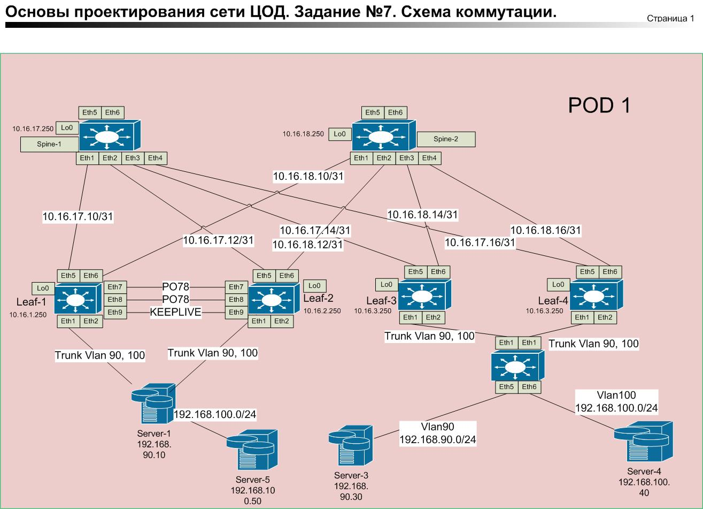

### Лабораторная работа №7

### Задание: Настроить отказоустойчивое подключение клиентов с использованием EVPN Multihoming.    

### Схема коммутации.       

      

### Схема L3.    

    

Leaf-1 и Leaf-2 конфигурации взята из предыдущей лабораторной работы. Настроен Mlag. Есть Server-1 (192.168.90.10 Vlan 90), Server-5 (192.168.100.50 Vlan 100).      

Leaf-3 и Leaf-4 настройки из предыдущих лабораторных работ. eBGP номера AS 65003 и 65004. Vxlan1 построен на Lo0. Есть два Vlan 90 и 100. Symmetric ARB (vrf VRF-Router).
Настройки Multihoming.   

Leaf-3    
!     
interface Port-Channel1   
   description to-Servers-host   
   switchport mode trunk   
   !
   evpn ethernet-segment    
      identifier 0000:0000:0000:0000:3401   
      designated-forwarder election algorithm preference 100   
      route-target import 00:00:00:00:34:01    
   lacp system-id 0000.0000.3401    
exit     

Leaf-4       

interface Port-Channel1    
   description to-Servers-host   
   switchport mode trunk    
   !    
   evpn ethernet-segment   
      identifier 0000:0000:0000:0000:3401    
      designated-forwarder election algorithm preference 90    
      route-target import 00:00:00:00:34:01     
   lacp system-id 0000.0000.3401    
   exit      

[Конфигурации стройств](./CFG/)

Portchannel поднялся.      
Leaf-3#show int status        
Port       Name            Status       Vlan     Duplex Speed  Type            Flags Encapsulation      
Et1        to-Servers-host connected    in Po1   full   1G     EbraTestPhyPort               
Et2                        connected    100      full   1G     EbraTestPhyPort              
Et3                        connected    120      full   1G     EbraTestPhyPort              
Et4                        connected    1        full   1G     EbraTestPhyPort              
Et5        to-Spine1-Eth3  connected    routed   full   1G     EbraTestPhyPort              
Et6        to-Spine2-Eth3  connected    routed   full   1G     EbraTestPhyPort              
Et7                        connected    1        full   1G     EbraTestPhyPort              
Et8                        connected    1        full   1G     EbraTestPhyPort              
Et9                        connected    1        full   1G     EbraTestPhyPort              
Et10                       connected    1        full   1G     EbraTestPhyPort              
    
Ma1                        connected    routed   a-full a-1G   10/100/1000                    
Po1        to-Servers-host connected    trunk    full   1G     N/A         

Leaf-3#show bgp evpn     (смотрим 0000:0000:0000:0000:3401)
BGP routing table information for VRF default     
Router identifier 10.16.3.250, local AS number 65003    
Route status codes: * - valid, > - active, S - Stale, E - ECMP head, e - ECMP     
                    c - Contributing to ECMP, % - Pending BGP convergence    
Origin codes: i - IGP, e - EGP, ? - incomplete      
AS Path Attributes: Or-ID - Originator ID, C-LST - Cluster List, LL Nexthop - Link Local N           exthop    

          Network                Next Hop              Metric  LocPref Weight  Path     
 * >      RD: 10.16.3.250:90 auto-discovery 0 0000:0000:0000:0000:3401     
                                 -                     -       -       0       i     
 * >      RD: 10.16.3.250:100 auto-discovery 0 0000:0000:0000:0000:3401    
                                 -                     -       -       0       i    
 * >      RD: 10.16.3.250:1 auto-discovery 0000:0000:0000:0000:3401     
                                 -                     -       -       0       i     
 * >Ec    RD: 10.16.4.250:1 auto-discovery 0000:0000:0000:0000:3401     
                                 10.16.4.250           -       100     0       65501 65004            i    
 *  ec    RD: 10.16.4.250:1 auto-discovery 0000:0000:0000:0000:3401    
                                 10.16.4.250           -       100     0       65501 65004            i     
 * >      RD: 10.16.3.250:90 mac-ip 0050.7966.6806    
                                 -                     -       -       0       i     
 * >      RD: 10.16.3.250:90 mac-ip 0050.7966.6806 192.168.90.30     
                                 -                     -       -       0       i     
 * >      RD: 10.16.3.250:100 mac-ip 0050.7966.6809     
                                 -                     -       -       0       i     
 * >      RD: 10.16.3.250:100 mac-ip 0050.7966.6809 192.168.100.40     
                                 -                     -       -       0       i     
 * >Ec    RD: 10.16.1.250:100 mac-ip 0050.7966.680b     
                                 10.16.1.251           -       100     0       65501 65001            i     
 *  ec    RD: 10.16.1.250:100 mac-ip 0050.7966.680b    
                                 10.16.1.251           -       100     0       65501 65001            i    
 * >Ec    RD: 10.16.2.250:100 mac-ip 0050.7966.680b    
                                 10.16.1.251           -       100     0       65501 65001            i       
 *  ec    RD: 10.16.2.250:100 mac-ip 0050.7966.680b      
                                 10.16.1.251           -       100     0       65501 65001            i      
 * >Ec    RD: 10.16.1.250:100 mac-ip 0050.7966.680b 192.168.100.50     
                                 10.16.1.251           -       100     0       65501 65001            i      
 *  ec    RD: 10.16.1.250:100 mac-ip 0050.7966.680b 192.168.100.50     
                                 10.16.1.251           -       100     0       65501 65001            i     
 * >Ec    RD: 10.16.2.250:100 mac-ip 0050.7966.680b 192.168.100.50     
                                 10.16.1.251           -       100     0       65501 65001            i     
 *  ec    RD: 10.16.2.250:100 mac-ip 0050.7966.680b 192.168.100.50     
                                 10.16.1.251           -       100     0       65501 65001            i     
 * >Ec    RD: 10.16.1.250:90 mac-ip 5000.00af.d3f6     
                                 10.16.1.251           -       100     0       65501 65001            i     
 *  ec    RD: 10.16.1.250:90 mac-ip 5000.00af.d3f6     
                                 10.16.1.251           -       100     0       65501 65001            i     
 * >Ec    RD: 10.16.1.250:90 mac-ip 5000.00af.d3f6 192.168.90.10     
                                 10.16.1.251           -       100     0       65501 65001            i     
 *  ec    RD: 10.16.1.250:90 mac-ip 5000.00af.d3f6 192.168.90.10     
                                 10.16.1.251           -       100     0       65501 65001            i      
 * >Ec    RD: 10.16.2.250:90 mac-ip 5000.00af.d3f6 192.168.90.10       
                                 10.16.1.251           -       100     0       65501 65001            i       
 *  ec    RD: 10.16.2.250:90 mac-ip 5000.00af.d3f6 192.168.90.10       
                                 10.16.1.251           -       100     0       65501 65001            i      
 * >Ec    RD: 10.16.1.250:90 imet 10.16.1.251       
                                 10.16.1.251           -       100     0       65501 65001            i     
 *  ec    RD: 10.16.1.250:90 imet 10.16.1.251    
                                 10.16.1.251           -       100     0       65501 65001            i    
 * >Ec    RD: 10.16.1.250:100 imet 10.16.1.251        
                                 10.16.1.251           -       100     0       65501 65001            i     
 *  ec    RD: 10.16.1.250:100 imet 10.16.1.251     
                                 10.16.1.251           -       100     0       65501 65001            i     
 * >Ec    RD: 10.16.2.250:90 imet 10.16.1.251     
                                 10.16.1.251           -       100     0       65501 65001            i     
 *  ec    RD: 10.16.2.250:90 imet 10.16.1.251
                                 10.16.1.251           -       100     0       65501 65001            i     
 * >Ec    RD: 10.16.2.250:100 imet 10.16.1.251     
5501 65001 i 
 *  ec    RD: 10.16.2.250:100 imet 10.16.1.251     
                                 10.16.1.251           -       100     0       65501 65001 i     
 * >      RD: 10.16.3.250:90 imet 10.16.3.250     
                                 -                     -       -       0       i    
 * >      RD: 10.16.3.250:100 imet 10.16.3.250     
                                 -                     -       -       0       i     
 * >Ec    RD: 10.16.3.250:90 imet 10.16.4.250     
                                 10.16.4.250           -       100     0       65501 65004 i     
 *  ec    RD: 10.16.3.250:90 imet 10.16.4.250         
                                 10.16.4.250           -       100     0       65501 65004 i        
 * >Ec    RD: 10.16.3.250:100 imet 10.16.4.250     
                                 10.16.4.250           -       100     0       65501 65004 i       
 *  ec    RD: 10.16.3.250:100 imet 10.16.4.250      
                                 10.16.4.250           -       100     0       65501 65004 i      
 * >      RD: 10.16.3.250:1 ethernet-segment 0000:0000:0000:0000:3401 10.16.3.250      
                                 -                     -       -       0       i      
 * >Ec    RD: 10.16.4.250:1 ethernet-segment 0000:0000:0000:0000:3401 10.16.4.250      
                                 10.16.4.250           -       100     0       65501 65004 i      
 *  ec    RD: 10.16.4.250:1 ethernet-segment 0000:0000:0000:0000:3401 10.16.4.250      
                                 10.16.4.250           -       100     0       65501 65004 i      
 * >Ec    RD: 65001:11 ip-prefix 192.168.90.0/24     
                                 10.16.1.251           -       100     0       65501 65001 i     
 *  ec    RD: 65001:11 ip-prefix 192.168.90.0/24     
                                 10.16.1.251           -       100     0       65501 65001 i     
 * >Ec    RD: 65001:12 ip-prefix 192.168.90.0/24      
                                 10.16.1.251           -       100     0       65501 65001 i      
 *  ec    RD: 65001:12 ip-prefix 192.168.90.0/24      
                                 10.16.1.251           -       100     0       65501 65001 i     
 * >      RD: 65003:13 ip-prefix 192.168.90.0/24     
                                 -                     -       -       0       i     
 * >Ec    RD: 65004:14 ip-prefix 192.168.90.0/24      
                                 10.16.4.250           -       100     0       65501 65004 i     
 *  ec    RD: 65004:14 ip-prefix 192.168.90.0/24     
                                 10.16.4.250           -       100     0       65501 65004 i    
 * >Ec    RD: 65001:11 ip-prefix 192.168.100.0/24     
                                 10.16.1.251           -       100     0       65501 65001 i      
 *  ec    RD: 65001:11 ip-prefix 192.168.100.0/24    
                                 10.16.1.251           -       100     0       65501 65001 i     
 * >Ec    RD: 65001:12 ip-prefix 192.168.100.0/24      
                                 10.16.1.251           -       100     0       65501 65001 i     
 *  ec    RD: 65001:12 ip-prefix 192.168.100.0/24     
                                 10.16.1.251           -       100     0       65501 65001 i     
 * >      RD: 65003:13 ip-prefix 192.168.100.0/24       
                                 -                     -       -       0       i      
 * >Ec    RD: 65004:14 ip-prefix 192.168.100.0/24          
                                 10.16.4.250           -       100     0       65501 65004 i        
 *  ec    RD: 65004:14 ip-prefix 192.168.100.0/24     
                                 10.16.4.250           -       100     0       65501 65004 i       
Leaf-3#       
 
Leaf-3#show bgp evpn route-type ethernet-segment        
BGP routing table information for VRF default   
Router identifier 10.16.3.250, local AS number 65003     
Route status codes: * - valid, > - active, S - Stale, E - ECMP head, e - ECMP    
                    c - Contributing to ECMP, % - Pending BGP convergence     
Origin codes: i - IGP, e - EGP, ? - incomplete      
AS Path Attributes: Or-ID - Originator ID, C-LST - Cluster List, LL Nexthop - Link Local Nexthop     
    
          Network                Next Hop              Metric  LocPref Weight  Path     
 * >      RD: 10.16.3.250:1 ethernet-segment 0000:0000:0000:0000:3401 10.16.3.250      
                                 -                     -       -       0       i
 * >Ec    RD: 10.16.4.250:1 ethernet-segment 0000:0000:0000:0000:3401 10.16.4.250     
                                 10.16.4.250           -       100     0       65501 65004 i      
 *  ec    RD: 10.16.4.250:1 ethernet-segment 0000:0000:0000:0000:3401 10.16.4.250       
                                 10.16.4.250           -       100     0       65501 65004 i     
Leaf-3#     
     
Leaf-3#show bgp evpn route-type ethernet-segment detail     
BGP routing table information for VRF default     
Router identifier 10.16.3.250, local AS number 65003     
BGP routing table entry for ethernet-segment 0000:0000:0000:0000:3401 10.16.3.250, Route Distinguisher: 10.16.3.250:1      
 Paths: 1 available    
  Local    
    - from - (0.0.0.0)     
      Origin IGP, metric -, localpref -, weight 0, tag 0, valid, local, best      
      Extended Community: TunnelEncap:tunnelTypeVxlan EvpnEsImportRt:00:00:00:00:34:01 DF Election: Preference 100      
BGP routing table entry for ethernet-segment 0000:0000:0000:0000:3401 10.16.4.250, Route Distinguisher: 10.16.4.250:1    
 Paths: 2 available     
  65501 65004     
    10.16.4.250 from 10.16.17.250 (10.16.17.250)      
      Origin IGP, metric -, localpref 100, weight 0, tag 0, valid, external, ECMP head, ECMP, best, ECMP contributor     
      Extended Community: TunnelEncap:tunnelTypeVxlan EvpnEsImportRt:00:00:00:00:34:01 DF Election: Preference 90     
  65501 65004     
    10.16.4.250 from 10.16.18.250 (10.16.18.250)      
      Origin IGP, metric -, localpref 100, weight 0, tag 0, valid, external, ECMP, ECMP contributor     
      Extended Community: TunnelEncap:tunnelTypeVxlan EvpnEsImportRt:00:00:00:00:34:01 DF Election: Preference 90      

      
Интерфейс поднят. 

Устройства между собой доступны. ping проходит без проблем.  
      
[Тестовые команды](./test)      
  
    
    
    
    

    

           
