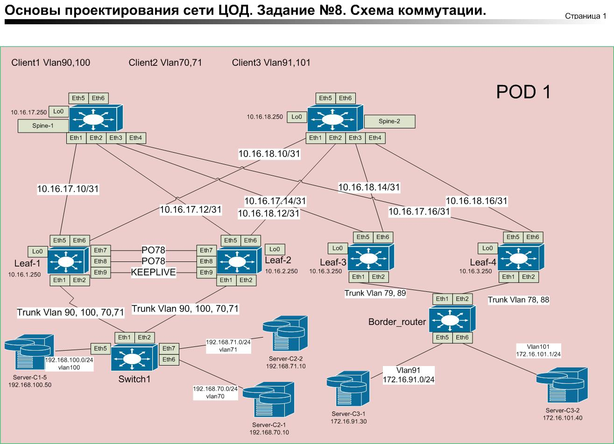

### Лабораторная работа №8     
### Задание.
Реализовать передачу суммарных префиксов через EVPN route-type 5.    

### Схема соединения.      

.      

Предположим у нас есть три клиента, которых нужно обьеденить. Клиент 1 (Vlan 90, 100) и клиент 2 (Vlan 70,71) находятся за коммутатором Switch1.    
Клиент 3 внешний за Border_router (Vlan 91, 101).
Клиент 1 находится в vrf Client-1. Vni 111111.         
Клиент 2 находится в vrf Client-2. Vni 222222.     
Клиент 3 подключен в отдельный vrf Clients-1-2 на Border_router.
Для передачи информации между клиентами будем использовать Border_router. Border_router подключен к Pod1 через Leaf-3 и Leaf-4.

Между Leaf-3 и Border_router используются два транзитных Vlan 89 (vrf Client-1) Vlan 79 (vrf Client-2).        
Leaf-3    
interface Ethernet1.1    
   encapsulation dot1q vlan 89    
   vrf Client-1     
   ip address 172.16.3.1/30    
exit       
interface Ethernet1.2    
   encapsulation dot1q vlan 79     
   vrf Client-2    
   ip address 172.16.3.5/30     
   exit      

Border_router     
interface Ethernet1.1     
   encapsulation dot1q vlan 89     
   vrf Clients-1-2      
   ip address 172.16.3.2/30    
!      
interface Ethernet1.2     
   encapsulation dot1q vlan 79       
   vrf Clients-1-2     
   ip address 172.16.3.6/30      
exit       
         

Между Leaf-4 и Border_router используются два транзитных Vlan 88 (vrf Client-1) Vlan 78 (vrf Client-2). 
Leaf-4     
interface Ethernet1.1    
   encapsulation dot1q vlan 88    
   vrf Client-1   
   ip address 172.16.4.1/30    
!     
interface Ethernet1.2     
   encapsulation dot1q vlan 78     
   vrf Client-2    
   ip address 172.16.4.5/30    
exit      

Border_router     
interface Ethernet2.1    
   encapsulation dot1q vlan 88   
   vrf Clients-1-2   
   ip address 172.16.4.2/30   
!   
interface Ethernet2.2   
   encapsulation dot1q vlan 78   
   vrf Clients-1-2   
   ip address 172.16.4.6/30   
  exit     

### Схема маршрутизации.      

### BGP    
### Leaf-3
router bgp 65003    
  vrf Client-1      
      rd 65003:13    
      route-target import evpn 11:111111    
      route-target export evpn 11:111111    
      neighbor 172.16.3.2 remote-as 65601     
      redistribute connected     
      !    
      address-family ipv4    
         neighbor 172.16.3.2 activate     
         redistribute connected     
   !     
   vrf Client-2     
      rd 65003:23      
      route-target import evpn 11:222222     
      route-target export evpn 11:222222     
      neighbor 172.16.3.6 remote-as 65601      
      redistribute connected      
      !      
      address-family ipv4    
         neighbor 172.16.3.6 activate    
         redistribute connected     
exit    
exit        
#### Leaf-4        
router bgp 65004     
   vrf Client-1      
      rd 65004:14      
      route-target import evpn 11:111111     
      route-target export evpn 11:111111    
      neighbor 172.16.4.2 remote-as 65601    
      redistribute connected     
      !    
      address-family ipv4    
         neighbor 172.16.4.2 activate    
         redistribute connected     
   !     
   vrf Client-2      
      rd 65004:24      
      route-target import evpn 11:222222    
      route-target export evpn 11:222222     
      neighbor 172.16.4.6 remote-as 65601  / Сосед Border_router /         
      redistribute connected      
      !
      address-family ipv4         
         neighbor 172.16.4.6 activate     
         redistribute connected      
exit      
end      
### Border_router    
ip prefix-list BGP_in seq 10 permit 0.0.0.0/0 le 28   / фильтрация маршрутов /    
!
ip route vrf Clients-1-2 192.168.0.0/16 Null0  / объеденяем маршруты  /    
     
router bgp 65601    
   vrf Clients-1-2    
      router-id 172.16.16.250    
      no bgp default ipv4-unicast     
      timers bgp 3 9    
      distance bgp 20 200 200     
      maximum-paths 2 ecmp 2     
      neighbor 172.16.3.1 remote-as 65003     
      neighbor 172.16.3.5 remote-as 65003     
      neighbor 172.16.4.1 remote-as 65004     
      neighbor 172.16.4.5 remote-as 65004     
      !     
      address-family ipv4         
         neighbor 172.16.3.1 activate        
         neighbor 172.16.3.1 prefix-list BGP_in in        
         neighbor 172.16.3.5 activate       
         neighbor 172.16.3.5 prefix-list BGP_in in       
         neighbor 172.16.4.1 activate          
         neighbor 172.16.4.1 prefix-list BGP_in in       
         neighbor 172.16.4.5 activate      
         neighbor 172.16.4.5 prefix-list BGP_in in      
         network 172.16.16.250/32      
         network 172.16.91.0/24       
         network 172.16.101.0/24      
         redistribute connected       
         redistribute static      
!      
end       

##### Готовые конфигурации      

[Конфигурации устройств](./CFG)      

     

