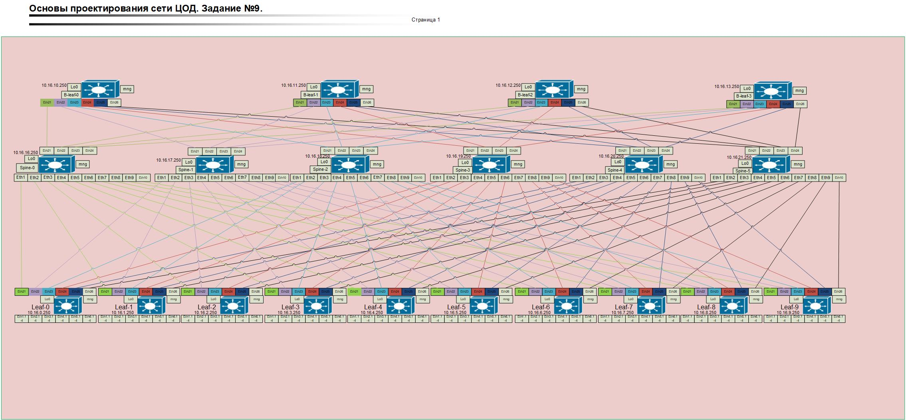

### Проектная работа.   
Создание ЦОД для финансовой организации имеющей две независимые сети не взаимодействующие между собой.   
Требование :   
1. ЦОД на 20 стоек.
2. 6 серверов в стойке. Всего 120 серверов. На каждый сервер по 2 порта 25 Gbs.
3. На базе современного оборудования   
4. Применение технологий Vxlan . Mlag.   
5. Порты UPLINK 100 Gbs. Порты DownLink 25 Gbs.    
6. Возможность роста до 3-х раз.
7.     

### 1. Архитектура сети
Топология: Clos (Leaf-Spine).    
Технологии:    
Underlay: iBGP (AS 65001) для обеспечения связности между Loopback-адресами.     
Overlay: VXLAN с использованием EVPN.    
Маршрутизация: Symmetric IRB (L3 VNI) для маршрутизации внутри VRF.     
Отказоустойчивость: MLAG на уровне Leaf для подключения серверов.    
Сегментация: Два изолированных VRF: UOS и IAS.    
Для подключения 120 серверов потребуется 240 портов + возможность роста до 3-х раз.   
Попробуем построить POD на коммутаторах Arista 7060CX-32S. 32 порта до 100G, если выбрать модуль 100G SR4 который    
поддерживает два режима передачи данных:
1. 100G пдключение (четыре канала по 25 G)
2. Breakout-подключение: Поддерживает разделение одного порта 100G на четыре порта 25G (4x25GBASE-SR) с помощью специальных гибридных кабелей.
То есть появляется возможность универсально использовать порты.
120 серверов по 50 Gbs это суммарно 6Tbs. Распределим нагрузку на 10 Leaf. На каждый Leaf приходится по 600 Gbs. Для передачи 600 Gbs между Leaf необходимо взять 6 Spine.
Для передачи информации во вне берем 4 B-Leaf.
Итоговая схема подключения:
           

### 2. Таблицы подключений.     

Взаимодействие сетевых интерфейсов:    

| N | Leaf/Spine | Spine-0 | Spine-1 | Spine-2 | Spine-3 | Spine-4 | Spine-5 |
|---|------------|---------|----------|---------|---------|---------|----------|
| 1 | Leaf-0  | Eth20/Eth0 | Eth21/Eth0 | Eth22/Eth0 | Eth23/Eth0 | Eth24/Eth0 | Eth25/Eth0 |  
| 2 | Leaf-1  | Eth20/Eth1 | Eth21/Eth1 | Eth22/Eth1 | Eth23/Eth1 | Eth24/Eth1 | Eth25/Eth1 |
| 3 | Leaf-2  | Eth20/Eth2 | Eth21/Eth2 | Eth22/Eth2 | Eth23/Eth2 | Eth24/Eth2 | Eth25/Eth2 |
| 4 | Leaf-3  | Eth20/Eth3 | Eth21/Eth3 | Eth22/Eth3 | Eth23/Eth3 | Eth24/Eth3 | Eth25/Eth3 |
| 5 | Leaf-4  | Eth20/Eth4 | Eth21/Eth4 | Eth22/Eth4 | Eth23/Eth4 | Eth24/Eth4 | Eth25/Eth4 |
| 6 | Leaf-5  | Eth20/Eth5 | Eth21/Eth5 | Eth22/Eth5 | Eth23/Eth5 | Eth24/Eth5 | Eth25/Eth5 |
| 7 | Leaf-6  | Eth20/Eth6 | Eth21/Eth6 | Eth22/Eth6 | Eth23/Eth6 | Eth24/Eth6 | Eth25/Eth6 |
| 8 | Leaf-7  | Eth20/Eth7 | Eth21/Eth7 | Eth22/Eth7 | Eth23/Eth7 | Eth24/Eth7 | Eth25/Eth7 |
| 9 | Leaf-8  | Eth20/Eth8 | Eth21/Eth8 | Eth22/Eth8 | Eth23/Eth8 | Eth24/Eth8 | Eth25/Eth8 |
| 10 | Leaf-9 | Eth20/Eth9 | Eth21/Eth9 | Eth22/Eth9 | Eth23/Eth9 | Eth24/Eth9 | Eth25/Eth9 |
| 11 | B-Leaf-0 | Eth20/Eth20 | Eth21/Eth20 | Eth22/Eth20 | Eth23/Eth20 | Eth24/Eth20 | Eth25/Eth20 |
| 12 | B-Leaf-1 | Eth20/Eth21 | Eth21/Eth21 | Eth22/Eth21 | Eth23/Eth21 | Eth24/Eth21 | Eth25/Eth21 |
| 13 | B-Leaf-2 | Eth20/Eth22 | Eth21/Eth22 | Eth22/Eth22 | Eth23/Eth22 | Eth24/Eth22 | Eth25/Eth22 |
| 14 | B-Leaf-3 | Eth20/Eth23 | Eth21/Eth23 | Eth22/Eth23 | Eth23/Eth22 | Eth24/Eth23 | Eth25/Eth23 |     

Для соединения 16 Leaf с 8 Spine (по 1 аплинку к каждому Spine):    
| Тип оборудования |	Кол-во устройств |	Модули 100G SR4 |	Модули 100G LR4 |	Модули 40G SR4 |	Модули 10G SR |    
|------------------|-------------------|------------------|-----------------|----------------|----------------|    
| Spine |	8 |	128 (к Leaf) |	-	| - |	- |    
| Leaf |	16 |	128 (к Spine) + 256 (на Downlink*) |	- |	- |	- |     
| BorderGW |	4	 | 48 (12x4) |	32 (8x4) |	24 (6x4) |	24 (6x4) |     
| Итого |	28 |	560 |	32 |	24 |	24 |         
*Примечание по Leaf: Для получения 32 портов Downlink 25G используется 8 модулей 100G SR4 в режиме Breakout (4x25G). Итого на 16 Leaf: 16 * (8 аплинков + 8 даунлинков) = 256 модулей.     
5. Расчет энергопотребления      
Расчет базируется на средней нагрузке (220W) + потреблении оптических модулей.     
Среднее потребление модуля 100G SR4 ≈ 2W, LR4 ≈ 3.5W.     
Spine (8 шт): 8 * (220W + 16 модулей * 2W) = 2016 W     
Leaf (16 шт): 16 * (220W + 16 модулей * 2W) = 4032 W      
BorderGW (4 шт): 4 * (220W + 83.5W + 122W + 61.5W + 61W) = 1148 W     
Общее среднее потребление системы: ~7.2 кВт      
Рекомендуемый запас по мощности БП (с учетом пиков до 410W на шасси): ~13 кВт.     
6. Конфигурация портов и переподписка    
Leaf-Downlink: 32 порта х 25 Гбит/с = 800 Гбит/с.    
Leaf-Uplink: 8 портов х 100 Гбит/с = 800 Гбит/с.     
Переподписка: 1:1 (физическая). Однако, с учетом того, что модель Arista 7060CX-32S имеет 32 порта 100G, у вас остается еще 16 свободных портов на каждом Leaf для будущего роста (доведения до 64 портов 25G), что и обеспечит целевую переподписку 1:2.      
7. Логическая структура (VXLAN/EVPN)      
Underlay (iBGP):    
Все устройства в одной AS 65001.    
Spine работают как Route Reflectors (RR).     
MTU: 9214 (Jumbo Frames) для инкапсуляции VXLAN.     
Overlay (Symmetric IRB):     
L3 VNI: Отдельный VNI для каждого VRF (UOS, IAS) для передачи трафика между подсетями.     
Anycast Gateway: Одинаковый IP/MAC на всех Leaf для каждого VLAN, что позволяет серверам мигрировать между стойками без смены шлюза.     
MLAG:     
Используется пара портов (например, 31-32) для MLAG Peer-link между соседними Leaf.     
8. Возможность роста      
Масштабирование Leaf: Текущая конфигурация Spine (8 шт по 32 порта) позволяет подключить до 32 Leaf-коммутаторов.     
Масштабирование Downlink: На текущих Leaf задействовано только 16 портов из 32. Можно удвоить количество серверных подключений на каждой стойке.    
Пропускная способность: Добавление дополнительных Spine-коммутаторов (максимум до 16-32 в зависимости от лицензий и дизайна) для увеличения аплинков.    

